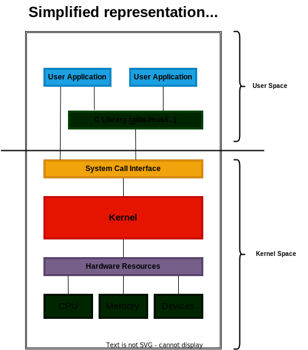

# Basics of a Linux System

## Where the Linux Kernel fits in a Linux system

Before we start, let's understand where the Linux Kernel fits in a Linux system either in a desktop or in an embedded
system.

The linux kernel is the core of the system, it's the first thing that runs when the system boots. It's responsible for
managing the hardware resources, scheduling processes, managing memory, etc.

As you can see from the image above, the kernel provides an abstraction layer between the hardware and the user space
applications that resides in the rootfs(root file system)/user-space interact with the kernel through the
[system call API](https://en.wikipedia.org/wiki/System_call).

Because the Linux kernel's system call API that is always
[backward compatible](https://en.wikipedia.org/wiki/Backward_compatibility), the user space applications don't need to
be recompiled or changed when a new kernel version is released. This adds a lot of flexibility to the system allowing us
to upgrade the kernel without the need to recompile the user space applications. In top pf that if your application
instead of using the system call API directly, uses the provided
[libc](https://en.wikipedia.org/wiki/C_standard_library) like [glibc](https://en.wikipedia.org/wiki/GNU_C_Library),
[musl](https://en.wikipedia.org/wiki/Musl) or any other, you add even more flexibility to the system because the libc
will abstract the system call API from the user space.

So let's say that you have a system running a Linux kernel version 4.14 and you want to upgrade it to the version 6.1.
You can just download the new kernel source code, configure and compile it and install it in the system, we will go over
all this steps in detail. The user space applications will continue to work without any change.

Below some reasons why you would want to upgrade the kernel:

- Be able to use new hardware features.
- Be able to use new security features.
- Fix previous kernel bugs that were affecting your system.
- If you are developing new features for the kernel, you may want to test it in a newer kernel version.
- Just for fun and learning.
