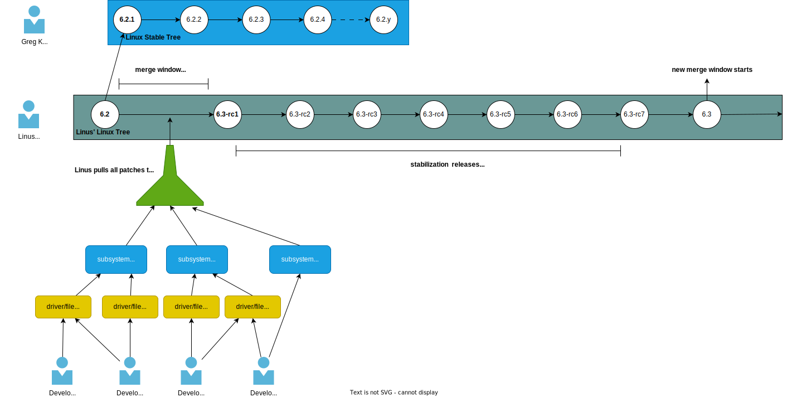

# Linux kernel release cycle

Before we dive into the kernel source code, we need to understand how the kernel development process works.
Linus started the development of the Linux kernel in the early 90's and since then, the kernel has been growing and
evolving an so its development process.

The kernel release cycle is divided into two main parts: the merge window and the stabilization period.

The merge window is the period of time where the kernel maintainers accept new features and changes to the kernel. It
starts after the release of the last stable version and lasts for two weeks. During this period, developers send
their patches generally to the subsystem maintainers. The subsystem maintainers are responsible for reviewing the
patches and sending them to Linus. Linus is the only one who can merge the patches into the mainline tree. To mark the
end of the merge window, Linus releases a new `-rc1` version. The `-rc1` version is the first release candidate of the
new kernel version.

After the merge window, the stabilization period starts. During this period, the kernel maintainers only accept patches
that fix bugs and regressions. The stabilization period lasts for six weeks to eight weeks and during this period, Linus
does a new release candidate every week. When Linus thinks that the kernel is stable enough, he releases the new stable
version which marks the end of the stabilization period and the beginning of a new merge window.

Once a stable version is released it is Greg Kroah-Hartman's responsibility to maintain it for a period of time. Greg
does this by creating in a separate git tree the
[linux-stable](https://git.kernel.org/pub/scm/linux/kernel/git/stable/linux.git) tree.
The main goal is to backport bug fixes and security patches to stable releases made by Linus. The amount of time that
that Greg maintains a stable version is generally until the next stable version is released. For example, if the stable
version `v6.2` is released, Greg will maintain it until the stable version `v6.3` is released unless the release is
marked as a long term stable (LTS) release. In this case, Greg will maintain the stable version for a longer period of
time.

Below is a simplified diagram of the release cycle.



Taken the diagram above as an example, lets do an exercise to list all commits/patches that were picked up by from the
upstream kernel tree and merged into the stable tree between `v6.2` and `v6.2.1`.

    ```bash
        #!/bin/bash
        # Clone the stable tree
        git clone https://git.kernel.org/pub/scm/linux/kernel/git/stable/linux.git --depth 1 linux-stable
        cd linux-stable
        # List all commits that were picked up from the upstream tree and merged into the stable tree between
        # v6.2 and v6.2.1. Feel free to change the range of tags to whatever you want.
         git log --pretty v6.2...v6.2.1 | grep -oP 'commit .* upstream\.$' | awk '{print $2}'
    ```

Paste the script above into a file and run it.

The output of the script above is the list of commits hashes that were picked up from the upstream tree and merged into
the stable tree between `v6.2` and `v6.2.1`:

    ```bash
    f3dd0c53370e70c0f9b7e931bbec12916f3bb8cc
    78f7a3fd6dc66cb788c21d7705977ed13c879351
    118901ad1f25d2334255b3d50512fa20591531cd
    0d9bdd8a550170306c2021b8d6766c5343b870c2
    3004e8d2a0a98bbf4223ae146464fadbff68bf78
    6c6cd913accd77008f74a1a9d57b816db3651daa
    36dd7a4c6226133b0b7aa92b8e604e688d958d0c
    47e91fdfa511139f2549687edb0d8649b123227b
    923510c88d2b7d947c4217835fd9ca6bd65cc56c
    ac0ee0a9560c97fa5fe1409e450c2425d4ebd17a
    db7adcfd1cec4e95155e37bc066fddab302c6340
    74e19ef0ff8061ef55957c3abd71614ef0f42f47
    ```

## References and further reading

[How the development process works](https://www.kernel.org/doc/html/latest/process/2.Process.html)

[Write and Submit your first Linux kernel Patch](https://www.youtube.com/watch?v=LLBrBBImJt4&ab_channel=FOSDEM)

[Linux Kernel Development, Greg Kroah-Hartman - Git Merge 2016](https://www.youtube.com/watch?v=vyenmLqJQjs&ab_channel=GitHub)

[Active kernel releases](https://www.kernel.org/category/releases.html)
